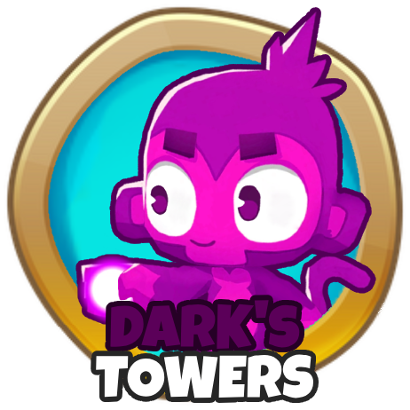

<h1 align="center">

Dark's Towers
</h1>

Remaster of the original [DarksTowers](https://github.com/DarkTerraYT/OGDarksTowers) mod (now known as OG Darks
Towers).
This is part of my goal of remastering my old mods to increase their quality as we all know they were pretty bad.

This mod adds three new towers all with full upgrade paths.

1. Plasma Monkey, A tower based completely on plasma, expensive, but strong!
2. Monkey of Light. A tower based off of light, not cheap nor expensive but still does quite well against packs of
bloons.
3. Cyber Monkey. The cheapest tower of them all. This tower is supposed to be tech based, but glitchy.

